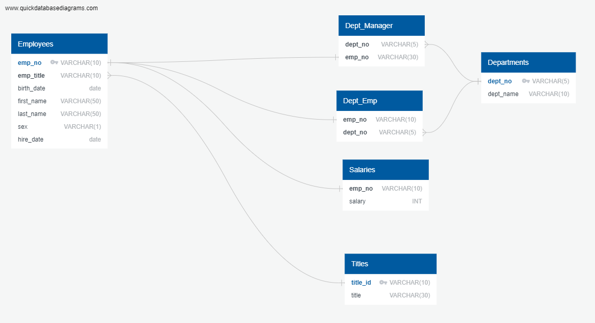

# sql-challenge

Background

Conducting a research project on individuals employed by the company during the 1980s and 1990s. The available data consists of six CSV files, which are the sole remnants of the employee database from that era.

Objectives

The project involves three main tasks:

1. Developing a data model for storing the CSV data.
2. Implementing data engineering processes to import the CSVs into a SQL database.
3. Conducting data analysis to address specific inquiries about the dataset.

Overview

This project contains three  files, two SQL files(employees_schemata.sql and employeeS_queries.sql) and one PNG file(employee_ERD):

The employees_schemata.sql file builds a relational database which contains tables that hold employees related data from imported csv files. Relationships are defined between tables and columns using primary keys, composite keys and foreign keys.
The employees_queries.sql file queries the desired employee information.
The employee_ERD file visually displays the structure of the tables and relationships between logically related tables of the database (This ERD was sketched using QuickDBD).

Data Modeling

After inspecting the CSVs, an ERD was created using Quick Database Diagrams.

Data Engineering

A table schema for each of the 6 CSV files with specific data types, primary keys, foreign keys, and constraints was created.

CREATE TABLE "Departments" (
    "dept_no" VARCHAR(5)   NOT NULL,
    "dept_name" VARCHAR(10)   NOT NULL,
    CONSTRAINT "pk_Departments" PRIMARY KEY (
        "dept_no"
     )
);

CREATE TABLE "Dept_Emp" (
    "emp_no" VARCHAR(10)   NOT NULL,
    "dept_no" VARCHAR(5)   NOT NULL
);

CREATE TABLE "Dept_Manager" (
    "dept_no" VARCHAR(5)   NOT NULL,
    "emp_no" VARCHAR(30)   NOT NULL
);

CREATE TABLE "Employees" (
    "emp_no" VARCHAR(10)   NOT NULL,
    "emp_title" VARCHAR(10)   NOT NULL,
    "birth_date" date   NOT NULL,
    "first_name" VARCHAR(50)   NOT NULL,
    "last_name" VARCHAR(50)   NOT NULL,
    "sex" VARCHAR(1)   NOT NULL,
    "hire_date" date   NOT NULL,
    CONSTRAINT "pk_Employees" PRIMARY KEY (
        "emp_no"
     )
);

CREATE TABLE "Salaries" (
    "emp_no" VARCHAR(10)   NOT NULL,
    "salary" INT   NOT NULL
);

CREATE TABLE "Titles" (
    "title_id" VARCHAR(10)   NOT NULL,
    "title" VARCHAR(30)   NOT NULL,
    CONSTRAINT "pk_Titles" PRIMARY KEY (
        "title_id"
     )
);

Data Analysis

1. List the employee number, last name, first name, sex, and salary of each employee.

SELECT e.emp_no, e.last_name, e.first_name, e.sex, s.salary
FROM employees e
JOIN salaries s
ON e.emp_no = s.emp_no;

2. List the first name, last name, and hire date for the employees who were hired in 1986.

SELECT first_name, last_name, hire_date 
FROM employees
WHERE hire_date BETWEEN '1986-1-1' and '1986-12-31'
ORDER BY hire_date ASC;

3. List the manager of each department along with their department number, department name, employee number, last name, and first name.

SELECT dm.dept_no, d.dept_name, dm.emp_no, e.last_name, e.first_name 
FROM dept_manager dm
JOIN employees e
ON dm.emp_no = e.emp_no
JOIN departments d
ON dm.dept_no = d.dept_no
ORDER BY d.dept_name ASC;

4. List the department number for each employee along with that employee’s employee number, last name, first name, and department name.

SELECT e.emp_no, e.last_name, e.first_name, d.dept_name
FROM employees e
JOIN dept_emp de 
ON e.emp_no = de.emp_no
JOIN departments d
ON d.dept_no = de.dept_no
ORDER BY d.dept_name ASC;

5. List the first name, last name, and sex of each employee whose first name is Hercules and whose last name begins with the letter B.

SELECT first_name, last_name, sex
FROM employees 
WHERE first_name = 'Hercules' AND last_name LIKE 'B%'
ORDER BY last_name ASC;

6. List each employee in the Sales department, including their employee number, last name, and first name.

SELECT e.emp_no, e.last_name, e.first_name, d.dept_name
FROM employees e
JOIN dept_emp de 
ON e.emp_no = de.emp_no
JOIN departments d
ON d.dept_no = de.dept_no
WHERE d.dept_name = 'Sales';

7. List each employee in the Sales and Development departments, including their employee number, last name, first name, and department name.

SELECT e.emp_no, e.last_name, e.first_name, d.dept_name
FROM employees e
JOIN dept_emp de 
ON e.emp_no = de.emp_no
JOIN departments d
ON d.dept_no = de.dept_no
WHERE d.dept_name = 'Sales' OR d.dept_name = 'Development'
ORDER BY d.dept_name ASC;

8. List the frequency counts, in descending order, of all the employee last names (that is, how many employees share each last name).

SELECT last_name, count(emp_no) as num_employees_with_same_last_name
FROM employees
GROUP BY last_name
ORDER BY num_employees_with_same_last_name DESC;